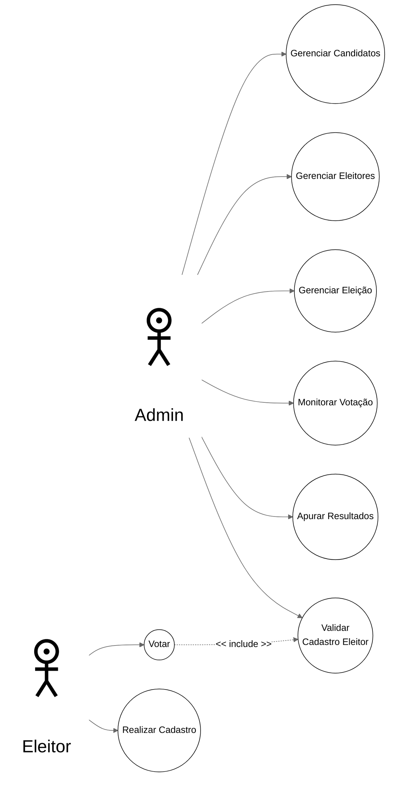

# Lista Completa de Casos de Uso do Sistema UE

## **📊 Casos de Uso**

---

# Especificação Detalhada dos Casos de Uso (UML)

## **UC1 - Realizar Votação**

| **Campo** | **Descrição** |
|-----------|---------------|
| **Ator Principal** | Eleitor |
| **Objetivo** | Permitir que o eleitor vote nos candidatos de sua escolha |
| **Pré-condições** | • UEv configurada e operacional • Eleitor habilitado para votar • Eleição em andamento |
| **Pós-condições** | • Voto registrado no sistema • Eleitor marcado como votante • Log de auditoria gerado |
| **Fluxo Principal** | **1.** Sistema solicita identificação do eleitor **2.** Eleitor informa número de inscrição **3.** Sistema valida elegibilidade do eleitor **4.** Sistema apresenta interface de votação **5.** Para cada cargo disponível: &nbsp;&nbsp;&nbsp;&nbsp;**5.1** Sistema exibe candidatos do cargo &nbsp;&nbsp;&nbsp;&nbsp;**5.2** Eleitor seleciona candidato OU vota em branco &nbsp;&nbsp;&nbsp;&nbsp;**5.3** Sistema confirma seleção **6.** Sistema apresenta resumo dos votos **7.** Eleitor confirma votação final **8.** Sistema registra votos **9.** Sistema exibe comprovante de votação **10.** Caso de uso encerra |
| **Fluxos Alternativos** | **FA1 - Eleitor inválido (passo 3):** &nbsp;&nbsp;&nbsp;&nbsp;**3.1** Sistema informa eleitor não habilitado &nbsp;&nbsp;&nbsp;&nbsp;**3.2** Sistema retorna ao passo 1  **FA2 - Correção de voto (passo 5.2):** &nbsp;&nbsp;&nbsp;&nbsp;**5.2.1** Eleitor altera seleção anterior &nbsp;&nbsp;&nbsp;&nbsp;**5.2.2** Sistema atualiza seleção &nbsp;&nbsp;&nbsp;&nbsp;**5.2.3** Retorna ao passo 5.3  **FA3 - Voto nulo (passo 5.2):** &nbsp;&nbsp;&nbsp;&nbsp;**5.2.1** Eleitor digita número inválido &nbsp;&nbsp;&nbsp;&nbsp;**5.2.2** Sistema registra voto nulo &nbsp;&nbsp;&nbsp;&nbsp;**5.2.3** Continua no passo 5.3 |
| **Fluxos de Exceção** | **FE1 - Eleitor já votou:** &nbsp;&nbsp;&nbsp;&nbsp;Sistema informa que eleitor já exerceu o direito de voto  **FE2 - Falha no sistema:** &nbsp;&nbsp;&nbsp;&nbsp;Sistema salva estado e solicita intervenção técnica |
| **Regras de Negócio** | • RN1: Eleitor só pode votar uma vez • RN2: Voto em branco é válido • RN3: Número inválido gera voto nulo • RN4: Todos os cargos devem ser votados |

---

## **Realizar Cadastro**
| **Campo** | **Descrição** |
|-----------|---------------|
| **Ator Principal** | Eleitor |
| **Objetivo** | Cadastrar para poder realizar a votação|
| **Pré-condições** | Usuario não cadastrado ainda|
| **Pós-condições** | É enviado para um administrador aceitar o cadastro|
| **Fluxo Principal** |a |
| **Fluxos Alternativos** | a|

---
## **UC2 - Configurar Eleição**

| **Campo** | **Descrição** |
|-----------|---------------|
| **Ator Principal** | Administrador |
| **Objetivo** | Configurar parâmetros gerais da eleição |
| **Pré-condições** | • Sistema UEg operacional • Administrador autenticado • Não há eleição em andamento |
| **Pós-condições** | • Eleição configurada no sistema • Parâmetros salvos no banco de dados |
| **Fluxo Principal** | **1.** Administrador acessa módulo de configuração **2.** Sistema apresenta formulário de eleição **3.** Administrador informa dados básicos: &nbsp;&nbsp;&nbsp;&nbsp;• Nome da eleição &nbsp;&nbsp;&nbsp;&nbsp;• Data e horário de início/fim &nbsp;&nbsp;&nbsp;&nbsp;• Tipo de eleição **4.** Administrador define cargos em disputa (até 8) **5.** Para cada cargo: &nbsp;&nbsp;&nbsp;&nbsp;**5.1** Define nome do cargo &nbsp;&nbsp;&nbsp;&nbsp;**5.2** Define número de vagas &nbsp;&nbsp;&nbsp;&nbsp;**5.3** Define regras específicas **6.** Administrador confirma configuração **7.** Sistema valida dados informados **8.** Sistema salva configuração **9.** Sistema confirma criação da eleição |
| **Fluxos Alternativos** | **FA1 - Dados inválidos (passo 7):** &nbsp;&nbsp;&nbsp;&nbsp;**7.1** Sistema exibe erros de validação &nbsp;&nbsp;&nbsp;&nbsp;**7.2** Retorna ao passo 3 |
| **Fluxos de Exceção** | **FE1 - Limite de cargos excedido:** &nbsp;&nbsp;&nbsp;&nbsp;Sistema impede cadastro do 9º cargo |
| **Regras de Negócio** | • RN5: Máximo 8 cargos por eleição • RN6: Data de início deve ser futura • RN7: Data fim deve ser posterior ao início |

---

## **UC3 - Gerenciar Candidatos**

| **Campo** | **Descrição** |
|-----------|---------------|
| **Ator Principal** | Administrador |
| **Objetivo** | Cadastrar, alterar e consultar candidatos da eleição |
| **Pré-condições** | • Eleição configurada • Administrador autenticado |
| **Pós-condições** | • Candidatos cadastrados/atualizados • Dados sincronizados com todas as UEv |
| **Fluxo Principal** | **1.** Administrador acessa gestão de candidatos **2.** Sistema exibe lista de candidatos cadastrados **3.** Administrador seleciona "Novo Candidato" **4.** Sistema apresenta formulário de cadastro **5.** Administrador informa dados obrigatórios: &nbsp;&nbsp;&nbsp;&nbsp;• Cargo pretendido &nbsp;&nbsp;&nbsp;&nbsp;• Nome completo &nbsp;&nbsp;&nbsp;&nbsp;• Nome de urna (apelido) &nbsp;&nbsp;&nbsp;&nbsp;• Número do candidato &nbsp;&nbsp;&nbsp;&nbsp;• Fotografia **6.** Administrador confirma cadastro **7.** Sistema valida dados informados **8.** Sistema salva candidato **9.** Sistema distribui dados para todas as UEv **10.** Sistema confirma cadastro realizado |
| **Fluxos Alternativos** | **FA1 - Alterar candidato (passo 3):** &nbsp;&nbsp;&nbsp;&nbsp;**3.1** Administrador seleciona candidato existente &nbsp;&nbsp;&nbsp;&nbsp;**3.2** Sistema carrega dados para edição &nbsp;&nbsp;&nbsp;&nbsp;**3.3** Continua no passo 5  **FA2 - Excluir candidato (passo 3):** &nbsp;&nbsp;&nbsp;&nbsp;**3.1** Administrador seleciona "Excluir" &nbsp;&nbsp;&nbsp;&nbsp;**3.2** Sistema solicita confirmação &nbsp;&nbsp;&nbsp;&nbsp;**3.3** Sistema remove candidato |
| **Fluxos de Exceção** | **FE1 - Número já utilizado:** &nbsp;&nbsp;&nbsp;&nbsp;Sistema informa duplicidade e solicita novo número |
| **Regras de Negócio** | • RN8: Número do candidato deve ser único por cargo • RN9: Foto é obrigatória • RN10: Nome de urna limitado a 30 caracteres |

---

## **UC4 - Gerenciar Eleitores**

| **Campo** | **Descrição** |
|-----------|---------------|
| **Ator Principal** | Administrador |
| **Objetivo** | Cadastrar, alterar e consultar eleitores aptos a votar |
| **Pré-condições** | • Sistema UEg operacional • Administrador autenticado |
| **Pós-condições** | • Base de eleitores atualizada • Dados distribuídos para as UEv |
| **Fluxo Principal** | **1.** Administrador acessa gestão de eleitores **2.** Sistema exibe opções de gestão **3.** Administrador seleciona "Cadastrar Eleitor" **4.** Sistema apresenta formulário **5.** Administrador informa dados obrigatórios: &nbsp;&nbsp;&nbsp;&nbsp;• Número do documento &nbsp;&nbsp;&nbsp;&nbsp;• Nome completo &nbsp;&nbsp;&nbsp;&nbsp;• UEv designada **6.** Administrador informa foto (opcional) **7.** Administrador confirma cadastro **8.** Sistema valida elegibilidade **9.** Sistema salva eleitor **10.** Sistema distribui dados para UEv designada |
| **Fluxos Alternativos** | **FA1 - Importar lista de eleitores (passo 3):** &nbsp;&nbsp;&nbsp;&nbsp;**3.1** Administrador seleciona "Importar" &nbsp;&nbsp;&nbsp;&nbsp;**3.2** Sistema solicita arquivo CSV/XML &nbsp;&nbsp;&nbsp;&nbsp;**3.3** Sistema processa lote de eleitores &nbsp;&nbsp;&nbsp;&nbsp;**3.4** Sistema exibe relatório de importação |
| **Fluxos de Exceção** | **FE1 - Eleitor já cadastrado:** &nbsp;&nbsp;&nbsp;&nbsp;Sistema pergunta se deseja atualizar dados |
| **Regras de Negócio** | • RN11: Número do documento deve ser único • RN12: Eleitor deve ter UEv designada • RN13: Foto é opcional |

---

## **UC7 - Apurar Resultados**

| **Campo** | **Descrição** |
|-----------|---------------|
| **Ator Principal** | Administrador |
| **Objetivo** | Consolidar votos de todas as UEv e calcular resultados |
| **Pré-condições** | • Votação encerrada • UEv transmitiram resultados |
| **Pós-condições** | • Resultados consolidados • Vencedores identificados por cargo |
| **Fluxo Principal** | **1.** Administrador inicia processo de apuração **2.** Sistema verifica se todas as UEv transmitiram **3.** Sistema consolida votos por cargo: &nbsp;&nbsp;&nbsp;&nbsp;**3.1** Soma votos de cada candidato &nbsp;&nbsp;&nbsp;&nbsp;**3.2** Contabiliza votos brancos e nulos &nbsp;&nbsp;&nbsp;&nbsp;**3.3** Calcula percentuais **4.** Sistema identifica vencedores por cargo **5.** Sistema gera relatório de apuração **6.** Administrador valida resultados **7.** Sistema finaliza apuração **8.** Sistema disponibiliza resultados oficiais |
| **Fluxos Alternativos** | **FA1 - UEv pendente (passo 2):** &nbsp;&nbsp;&nbsp;&nbsp;**2.1** Sistema lista UEv que não transmitiram &nbsp;&nbsp;&nbsp;&nbsp;**2.2** Administrador decide se prossegue &nbsp;&nbsp;&nbsp;&nbsp;**2.3** Se sim, continua no passo 3 |
| **Fluxos de Exceção** | **FE1 - Inconsistência nos dados:** &nbsp;&nbsp;&nbsp;&nbsp;Sistema reporta divergências para análise |
| **Regras de Negócio** | • RN19: Todos os votos devem ser contabilizados • RN20: Empates devem ser sinalizados |

---

## **UC8 - Exportar Relatórios Relatórios**

| **Campo** | **Descrição** |
|-----------|---------------|
| **Ator Principal** | Administrador |
| **Objetivo** | Produzir relatórios diversos sobre a eleição |
| **Pré-condições** | • Dados disponíveis no sistema • Administrador autenticado |
| **Pós-condições** | • Relatórios gerados • Arquivos disponibilizados |
| **Fluxo Principal** | **1.** Administrador acessa módulo de relatórios **2.** Sistema apresenta tipos de relatório: &nbsp;&nbsp;&nbsp;&nbsp;• Resultados por UEv &nbsp;&nbsp;&nbsp;&nbsp;• Resultados consolidados &nbsp;&nbsp;&nbsp;&nbsp;• Comparecimento eleitoral &nbsp;&nbsp;&nbsp;&nbsp;• Relatório de auditoria **3.** Administrador seleciona tipo de relatório **4.** Sistema solicita parâmetros específicos **5.** Administrador define filtros e formato **6.** Sistema processa dados solicitados **7.** Sistema gera relatório (PDF/Excel) **8.** Sistema disponibiliza arquivo para download |
| **Fluxos Alternativos** | **FA1 - Relatório personalizado (passo 3):** &nbsp;&nbsp;&nbsp;&nbsp;**3.1** Administrador escolhe "Personalizado" &nbsp;&nbsp;&nbsp;&nbsp;**3.2** Sistema permite seleção de campos &nbsp;&nbsp;&nbsp;&nbsp;**3.3** Continua no passo 5 |
| **Fluxos de Exceção** | **FE1 - Erro na geração:** &nbsp;&nbsp;&nbsp;&nbsp;Sistema reporta problema e sugere parâmetros alternativos |
| **Regras de Negócio** | • RN21: Relatórios devem incluir data/hora de geração • RN22: Formatos: PDF para oficiais, Excel para análises |

---
